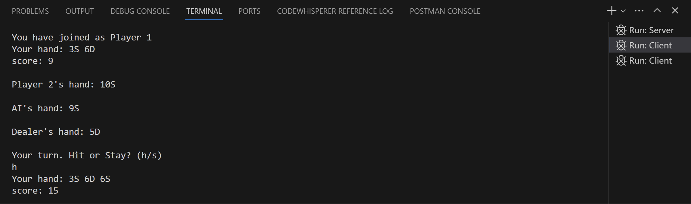
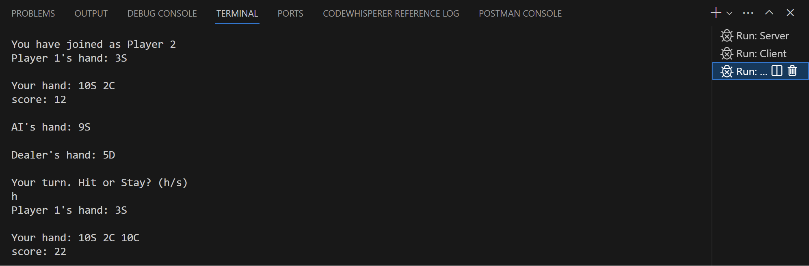
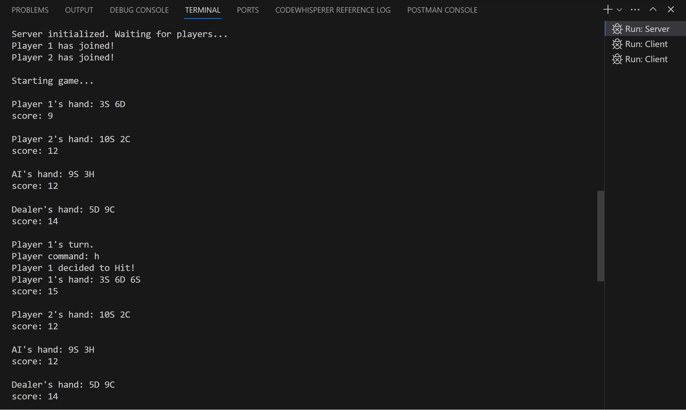

# BlackJack-Java-Sockets
 A console-based BlackJack game including 2 players, AI and Dealer, created with Java Sockets to demonstrate a server-client application.

 ### To Play:
 - Run ```Server.java``` to start the server
 - Run ```Client.java``` to join as Player 1
 - Run ```Client.java``` again to join as Player 2
 - Each player has their own console where they can see their hand along with 1 card of every other player and enter commands to play blackjack. For example:\
 **Player 1:** \
 **Player 2:** \
 And the Server console shows the overall game:\
 **Server Console:** 
